# VR_Assignment1

# Question 1: Coin Detection, Segmentation and Counting

- The coin detection algorithm faced 3 main challenges in the first implementation.
-  First, some coins were merged in the segmentation output due to connected edges after preprocessing. This occurs when the edge detection and morphological operations create bridges between adjacent coins, causing the contour detection to interpret them as a single object.
-  This is particularly evident in cases where two or more coins are close together or touching as can be seen in the original as well as segmented outputs below.
- The second issue involves missed coin detections, where the algorithm failed to outline all coins in the image due to suboptimal edge detection parameters (Canny thresholds too strict at 200-250), inadequate blur kernel size, and morphological operations that don't effectively separate touching coins while maintaining edge integrity.
- The  use of RETR_EXTERNAL in contour detection also limits the algorithm to only outer contours, missing internal boundaries when coins are touching. Additionally, the lack of shape-based validation (like circularity checks) and proper distance-based separation means that merged coins aren't being properly identified and separated, leading to incorrect coin counts and segmentation results.
- Third, some of the segmented coin images, only had the coin outline and not the interior structure. This occurs due to binary masking (cv2.bitwise_and) losing internal pixel intensities. This affects only some coins because variations in lighting and contrast across the image result in inconsistent edge detection and contour filling - coins with stronger contrast retain their details while those with weaker boundaries get reduced to outlines.

  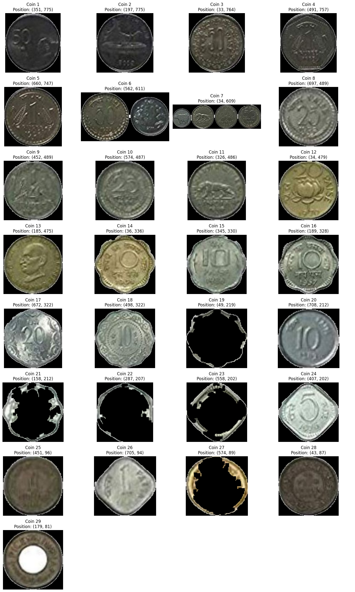
  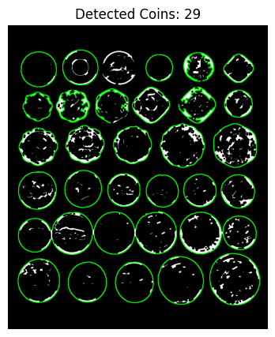
  

# Question 2: Panorama Stitching

Keypoints of 3 overlapping images were identified using SIFT and they were stitched together using OpenCV's stitcher class. The following section shows the final satisfactory output. The next section will show the outputs that were not satisfactory and then the analysis of the entire process. 

## Optimal Results
### Input Images

The following three images of a living room were used as input:

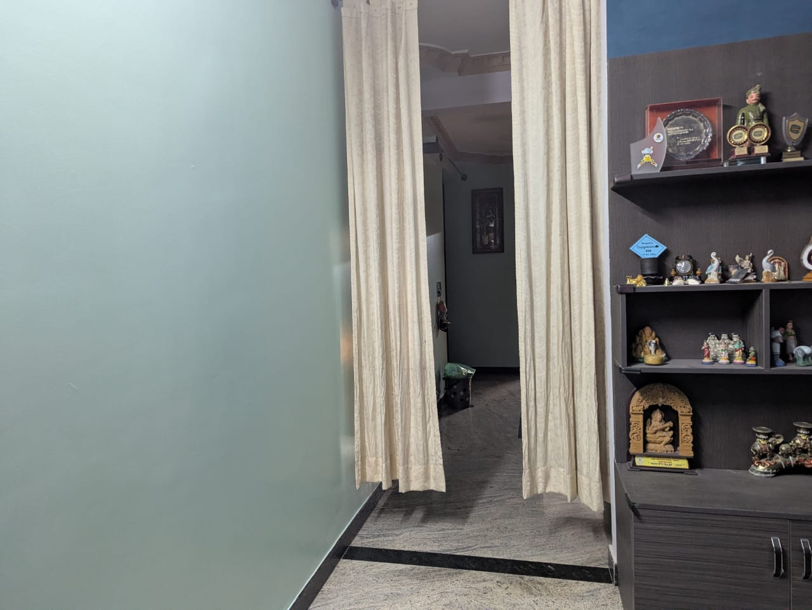
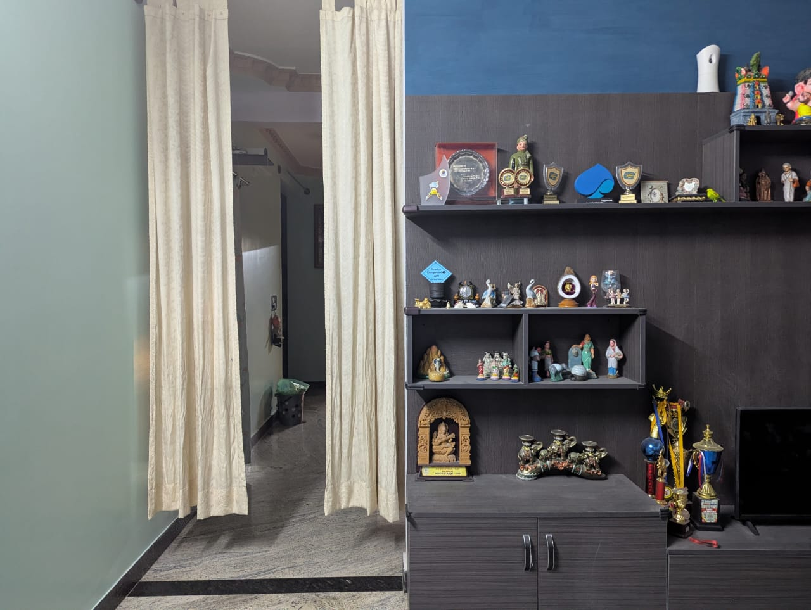
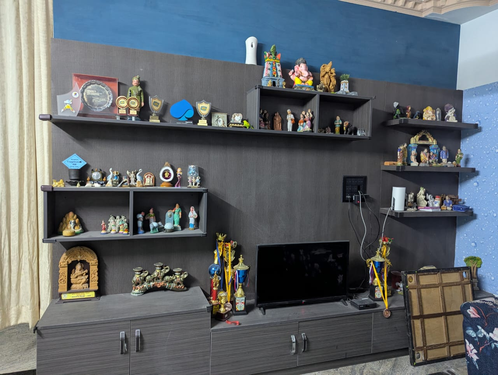

### Process

1. **Image Loading**: 
   - Three overlapping images were loaded using OpenCV
   - Images were converted from BGR to RGB color space for visualization

2. **Feature Detection**:
   - SIFT (Scale-Invariant Feature Transform) algorithm was used for feature detection
   - SIFT parameters were tuned with contrastThreshold=0.04 for better feature detection
   - Keypoints were detected and visualized on each image:

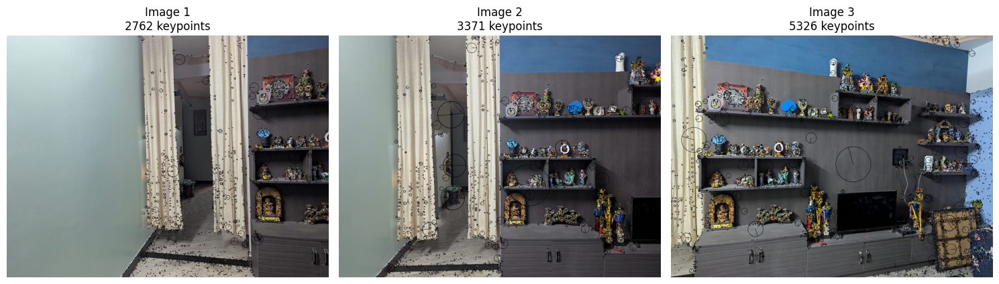

3. **Image Stitching**:
   - OpenCV's Stitcher class was used in PANORAMA mode
   - Images were automatically aligned and blended
   - The final panorama was generated:

### Implementation

The implementation uses the following key components:
- OpenCV for image processing and stitching
- SIFT algorithm for feature detection
- Matplotlib for visualization
- NumPy for array operations

## Alternative Attempts and Analysis

1. **Using a custom stitching function for creating the panorama**
   - The distortion in the panorama can be attributed to several factors in this implementation.
   - The FLANN-based matching with a ratio test threshold of 0.8 could be too lenient, potentially including incorrect matches that affect the homography calculation.
   - The homography estimation using RANSAC with a reprojection threshold of 5.0 might not be optimal for these specific images, causing perspective distortions.
   - The blending approach using a Gaussian mask, while attempting to create smooth transitions, might have introduced ghosting effects when the alignment wasn't perfect.
   - The sequential stitching approach (stitching images one by one) can accumulate errors, as any misalignment in earlier steps propagates and amplifies through subsequent stitching operations. This explains why the final panorama appears distorted compared to the OpenCV Stitcher class implementation, which uses a more sophisticated global alignment and blending strategy.
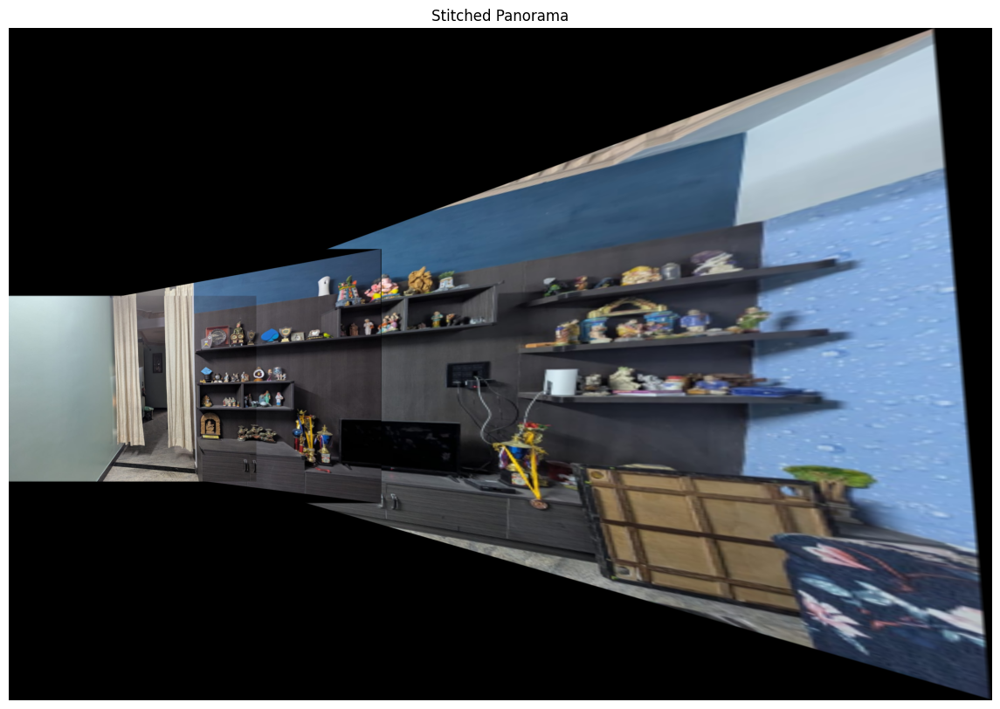

2. **Using other sets of images**
   - I tried to perform stitching on another indoor scene - hostel common room and an outdoor scene - consisting of lots of trees (balcony view). The results are summarised below.
   - There was a huge variation in panorama quality between the two indoor scenes - living room(Refer to the Optimal Results section) and the hostel common room (elaborated below).
   -  The living room scene had more favorable characteristics for stitching: consistent depth of field, well-distributed features across the frame, and uniform lighting conditions.
   -  In contrast, the hostel room scene presented more challenging conditions. The presence of a sofa in close proximity to the camera created significant parallax error.
   -  This parallax effect violates the fundamental assumption in panoramic stitching that the scene can be approximated as a planar surface viewed from different angles.
   -  While the transformation to LAB color space and subsequent image enhancement operations (smoothing and edge enhancement) helped improve feature detection by reducing noise and emphasizing structural elements, they couldn't fully compensate for the inherent geometric challenges posed by the varying depth planes.
   -  The LAB color space transformation was particularly helpful because it separated luminance from chrominance, allowing for better feature detection in areas with varying lighting conditions, but the fundamental issue of parallax distortion from the close-up sofa remained a limiting factor in achieving seamless stitching.
   -  Note that in the results below "Original Image" refers to the RGB image itself and the "Enhanced Image" refered to the image in the LAB color space.
   -  Additionally, the presence of windows in the hostel room scene introduced significant exposure variations, with bright light sources creating high contrast areas and uneven illumination across the capturing plane. These extreme lighting differences from the windows caused inconsistent feature detection between overlapping images and created challenges in blending areas where bright window light met darker indoor shadows, further complicating the stitching process.
   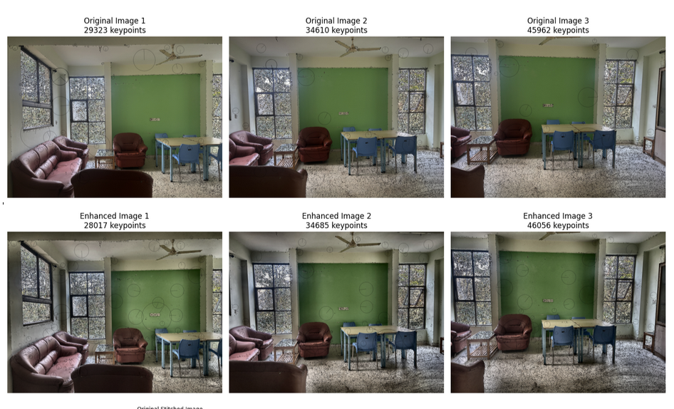
   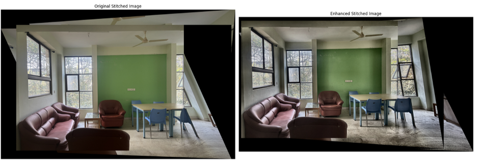
   - The panorama stitching of the outdoor scene presented interesting challenges and results.
   -  The algorithm successfully maintained color consistency and achieved decent alignment in the central regions, particularly in the tree foliage and ground areas, it struggled with perspective distortion at the edges.
   -  The presence of approximately 100,000 keypoints per image, while providing extensive feature detection, may have introduced noise in the matching process.
   -   Notable issues include black regions at the image boundaries and visible seam lines, particularly in the walkway area.
   -   These artifacts can be attributed to parallax errors from varying object depths, the repetitive patterns in the foliage challenging the feature matching process, and possible camera rotation during capture.
   -   The results as shown below highlight the delicate balance needed between having sufficient keypoints for matching while avoiding noise that can affect the homography calculation and final stitching quality.
   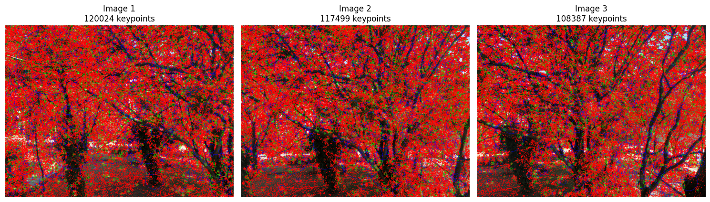
   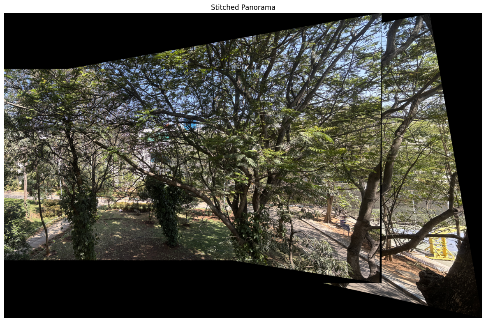

