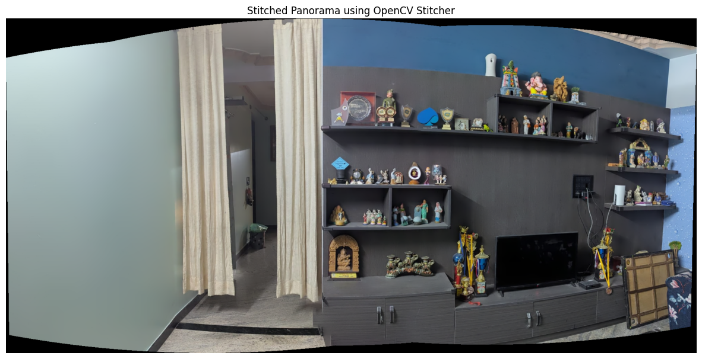

# VR_Assignment1

# Question 2: Panorama Stitching

Keypoints of 3 overlapping images were identified using SIFT and they were stitched together using OpenCV's stitcher class. The following section shows the final satisfactory output. The next section will show the outputs that were not satisfactory and then the analysis of the entire process. 

## Optimal Results
### Input Images

The following three images of a living room were used as input:

### Process

1. **Image Loading**: 
   - Three overlapping images were loaded using OpenCV
   - Images were converted from BGR to RGB color space for visualization

2. **Feature Detection**:
   - SIFT (Scale-Invariant Feature Transform) algorithm was used for feature detection
   - SIFT parameters were tuned with contrastThreshold=0.04 for better feature detection
   - Keypoints were detected and visualized on each image:

3. **Image Stitching**:
   - OpenCV's Stitcher class was used in PANORAMA mode
   - Images were automatically aligned and blended
   - The final panorama was generated:

### Implementation

The implementation uses the following key components:
- OpenCV for image processing and stitching
- SIFT algorithm for feature detection
- Matplotlib for visualization
- NumPy for array operations

## Alternative Attempts and Analysis
